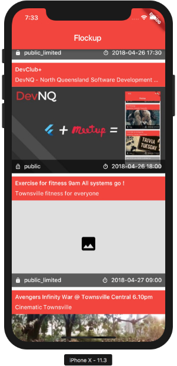
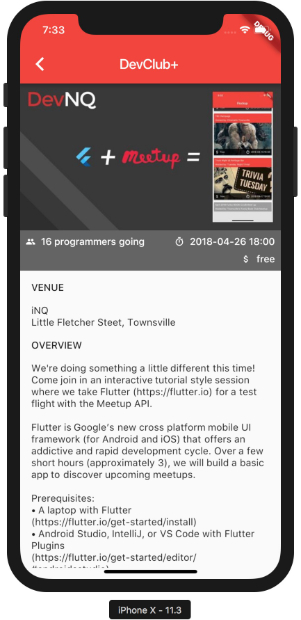
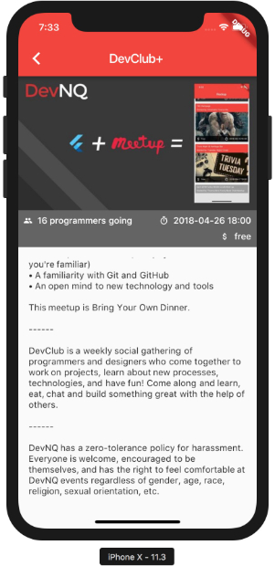

# Flockup

Flutter meets Meetup. What could go wrong?

## Prerequisites
* A laptop with Flutter [install flutter](https://flutter.io/get-started/install)
* Android Studio, IntelliJ, or VS Code with Flutter Plugins [Getting Started with the editor](https://flutter.io/get-started/editor/)
* Android/iOS Simulator (or a physical device if you're familiar)

## Getting Started

1. Phase 1 [Getting Meetup Events](1_Connect_to_meetup.md)
2. Phase 2 [Showing The Event Listings](2_Home_layout.md)
3. Phase 3 [Event Detail](3_Event_detail.md)

## Potential Final Product

