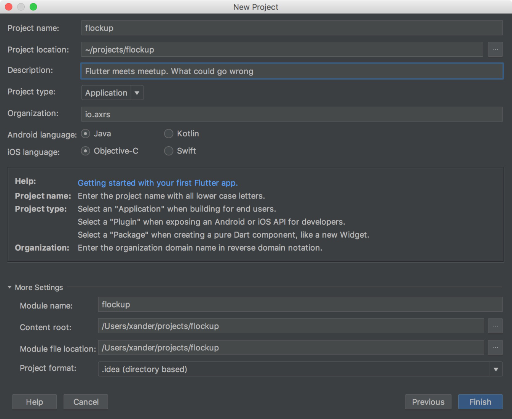

# Phase 1
## Create a new project

Using your editor of choice, create an new flutter project. The steps for intelliJ are included below:




## Getting Meetup Events

### Add Dependencies
Like most projects, we need to add a few dependencies to make our lives a little easier. We will add the following to
the `pubspec.yaml`

* `feather: ^0.0.6`
  A flutter utility library with re-frame esk features
* `http: ^0.11.3+16`
  A composable, Future-based API for making HTTP requests.
* `intl: ^0.15.4`
  Contains code to deal with internationalized/localized messages, date and number formatting and parsing,
  bi-directional text, and other internationalization issues.

Our `pubspec.yaml` should now look like:

```yaml
name: flockup
description: Flutter meets Meetup. What could go wrong?

dependencies:
  flutter:
    sdk: flutter
  cupertino_icons: ^0.1.0
  feather: ^0.0.6
  http: ^0.11.3+16
  intl: ^0.15.4

dev_dependencies:
  flutter_test:
    sdk: flutter

flutter:
  uses-material-design: true
```

At this stage, your editor should detect a dependency change and ask to install the new packages. You'll want to do this.
Alternatively, you can jump into the terminal and run `flutter packages get`

### Get a Meetup API Key

Head over to https://secure.meetup.com/meetup_api/key/ to get yourself an API key. Keep this in a safe place and avoid
the public sharing of it.

Create a new dart file `lib/config.dart` and put the token in there.

```dart
const String MEETUP_API_KEY = "<Your Token Here>";
```

### App Foundations
This Flockup guide is built with a reactive flow, or perpetual loop in mind.

1. Event dispatch

   _An event is sent when something happens - the user taps a widget._

2. Event handling

   _In response to an event, an application must decide what action to take._

3. Query

   _Extracting data from "app state", and providing it in the right format for view functions._

4. View

   _One or more view functions (or widgets) that compute the UI that should be displayed._

To achieve this, the "app state" is stored in memory (as a hash-map), and provided to each widget in the UI tree. The
widgets (during construction or render), are able to restore extract the necessary data for visulation. When the "app
state" changes, the entire view tree will be re-created as needed.

> Notes
* Flutter refreshes the view tree for every new frame. Creating as many objects that may live for only one frame
(a sixtieth of a second for 60 FPS).
* Flutter performs single pass layout and rendering calculations to optimise performance.
* Flutter/dart uses Generational Garbage collection (like many other frameworks). The most recently created objects are also
  those most likely to become unreachable quickly.

#### App UI Setup

Let's remove the boilerplace code in `lib/main.dart` and change it to adopt the flow outlined above.

1. Start by creating a main function. This is going to be the entry point into our Flutter Application, and construct
our root widget `Flockup`

```dart
//lib/main.dart
import 'package:feather/feather.dart';
import 'package:flockup/config.dart';
import 'package:flutter/material.dart';

void main() => runApp(new Flockup());

```

2. Next we need to create our root `Flockup` class. The aim of this widget is establish a "state stream", and respond to
   any state changes by triggering a rebuild. This is achieved by creating a `AppDbStream` and leveraging the
   `StreamBuilder` classes.

```dart
class Flockup extends StatelessWidget {

  //
  //Create a StateStream. This will hold the current "app db" for other widgets to use in Step 3 of the flow
  //
  final AppDbStream stateStream = new AppDbStream(AppDb.onUpdate);

  @override
  Widget build(BuildContext context) {
    return new MaterialApp(
        title: 'Flockup',
        theme: new ThemeData(
          primarySwatch: Colors.red,
        ),
        //
        // This defines our
        // - initial `home` view
        // - `stream` to listen to
        // - `initialState` or "app db" to use
        // - what to do when a new state is added to the stream via `builder`
        //
        home: new StreamBuilder<Map>(
          stream: stateStream,
          initialData: AppDb.init({}).store,
          builder: (context, snapshot) => buildHome(context, snapshot.data),
        ));
  }
}
```

3. When the "app db" changes, the root `home` view will run the `buildHome` function which will layout our home view:

```dart
Widget buildHome(BuildContext context, Map appDb) {
  //
  // Get the list of `events` from the appDb, or return an empty list
  //
  final List<Map> events = asMaps(get(appDb, 'events', []));

  //
  // The Scaffold widget provides us the ability to use an `appBar`, `body`, and `floatingActionButton`. It's a nice and
  // simple material widget for Flockup
  //
  return Scaffold(
    appBar: AppBar(
      title: new Text("Flockup"),
    ),
    //
    // The main layout (for now) will be a Centered Column view, with a Text label
    //
    body: Center(
      child: Column(
        mainAxisAlignment: MainAxisAlignment.center,
        children: <Widget>[
          Text(events.length.toString()),
        ],
      ),
    ),
  );
}
```

Flockup should now resemble something like:


#### Fetching Events from Meetup

Now it's time to put the API key to good use by fetching upcoming events using https://secure.meetup.com/meetup_api/console/?path=/find/upcoming_events.
We should be able to retrieve a list of events near a provided latitude and longitude.

> Note: The return map contains a city and events key. We are really only interested in the events

```json
{
  "city": {
    "id": 1000665,
    "city": "Townsville",
    "lat": -19.26,
    "lon": 146.78,
    "state": "",
    "country": "au",
    "zip": "meetup13",
    "member_count": 158
  },
  "events": [
    {
      "created": 1519041041000,
      "duration": 7200000,
      "id": "247953034",
      "name": "DevClub+",
      "rsvp_limit": 40,
      "status": "upcoming",
      "time": 1524729600000,
      "local_date": "2018-04-26",
      "local_time": "18:00", <-----------------------------------------// Not always avilable
      "updated": 1522753424000,
      "utc_offset": 36000000,
      "waitlist_count": 0,
      "yes_rsvp_count": 11,
      "venue": {
        "id": 25716263,
        "name": "iNQ",
        "lat": -19.26728630065918,
        "lon": 146.8111114501953,
        "repinned": false,
        "address_1": "Little Fletcher Steet",
        "city": "Townsville",
        "country": "au",
        "localized_country_name": "Australia"
      },
      "group": {
        "created": 1462718150000,
        "name": "DevNQ - North Queensland Software Development Meetup",
        "id": 19928864,
        "join_mode": "open",
        "lat": -19.260000228881836,
        "lon": 146.77999877929688,
        "urlname": "dev_nq",
        "who": "programmers",
        "localized_location": "Townsville, Australia",
        "region": "en_US"
      },
      "link": "https://www.meetup.com/dev_nq/events/247953034/",
      "description": "Some event description", <-------------------------// Sometimes Missing
      "visibility": "public"
    },
    {
      "link": "https://www.meetup.com/Townsville-fitness-for-everyone/events/249735461/",
      "visibility": "public_limited",
      "group": {
        "created": 1436766625000,
        "name": "Townsville fitness for everyone",
        "id": 18737565,
        "join_mode": "approval",
        "lat": -19.260000228881836,
        "lon": 146.77999877929688,
        "urlname": "Townsville-fitness-for-everyone",
        "who": "Members",
        "localized_location": "Townsville, Australia",
        "region": "en_US"
      },
      "waitlist_count": 0,
      "yes_rsvp_count": 1,
      "duration": 3600000,
      "time": 1524123000000,
      "utc_offset": 36000000,
      "name": "Cross fit Squad!- Fitness with Renee- Build that physique !",
      "id": "bhlsfpyxgbzb"
    }
  ]
}
```

Depending on the Meetup events visibility (public, public_limited, or private), an event could be missing `local_time`,
`description` and many other fields. It's not something we have to deal with currently, but worth keeping in mind.

1. Create `lib/actions.dart` to hold all our action logic.
2. Setup a basic fetch function. It's purpose to request the list of events from meetup and update the "app db" when
   complete.

```dart
import 'dart:convert' show JSON;

import 'package:feather/feather.dart';
//
// The MEETUP_API_KEY should be available after importing `config.dart`
//
import 'package:flockup/config.dart';
import 'package:http/http.dart' as http;

//
// The API endpoint we are going to request events from
//
const String EVENTS_URL = "https://api.meetup.com/find/upcoming_events";

void fetchEvents() {
  //
  // The API we're communicating with uses GET requests. As such, we need to put our params into the query string.
  //
  final String url = EVENTS_URL +
      mapToQueryParam({
        "fields": "featured_photo,plain_text_description", // Tells Meetup to include the event photo and a raw text description
        "key": MEETUP_API_KEY,
        "lat": -19.26639,
        "lon": 146.80569,
        "radius": "smart",
        "sign": "true",
      });

  //
  // Perform the request, then (on success), extract the events and merge the events into the existing state
  // Note: The merge function combines two key/value maps, overriding keys from the latter values
  //
  http.get(url).then((response) {
    var body = JSON.decode(response.body);
    var events = get(body, 'events');
    AppDb.dispatch(
        (Map store) => merge(store, {"events": events}));
  });
}
```

3. Create a simple `mapToQueryParam` helper function to keep our URL readable, and remove any null values.

```dart
//
// Takes a map `{"key": "value", "other": "thing"}` and converts it to `?key=value&other=thing`
//
String mapToQueryParam(Map params) {
  return "?" +
      params.entries
          .where((e) => isNotNull(e.value))
          .map((e) => '${e.key}=${e.value}')
          .join("&");
}
```

4. Wire it up on app load and see how we did!

```dart
// lib/main.dart
import 'package:flockup/actions.dart';
//
// ...
//

class Flockup extends StatelessWidget {
  final AppDbStream stateStream = new AppDbStream(AppDb.onUpdate);

  @override
  Widget build(BuildContext context) {
    fetchEvents();       //<----- NEW
    return MaterialApp(
        title: 'Flockup',
        theme: ThemeData(
          primarySwatch: Colors.red,
        ),
        home: new StreamBuilder<Map>(
          stream: stateStream,
          initialData: AppDb.init({}).store,
          builder: (context, snapshot) => buildHome(context, snapshot.data),
        ));
  }
}
```

If all went well, we should now have a count of upcoming events


[NEXT](2_Home_layout.md)
