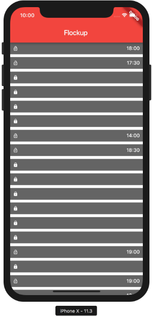
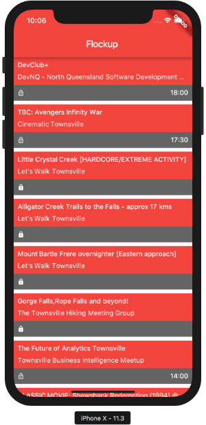
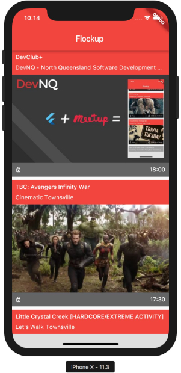

# Phase 2
## Showing The Event Listings

Now that we have some events, we need to update our `lib/main.dart` to display something a little more useful that just
a count.

1. Create a new `StatelessWidget` that will be a `ListView` of the events

```dart
class EventListWidget extends StatelessWidget {
  //
  // Keep a list of events (passed in by the constructor)
  //
  final List<Map> events;
  final ScrollController scrollController;

  EventListWidget(this.events) : scrollController = new ScrollController();

  @override
  Widget build(BuildContext context) {
    //
    // The EventListWidget will just return a new ListView of our events.
    // We will delegate the Widgets hierarchy builder to a separate event
    //
    return new ListView.builder(
      itemCount: events.length,
      controller: scrollController,
      itemBuilder: (BuildContext context, int itemIndex) {
        if (itemIndex <= events.length) {
          return buildEventListItem(context, events[itemIndex]);
        }
      },
    );
  }
}
```

2. Update the `buildHome` function to create a new `EventListWidget`

```dart
Widget buildHome(BuildContext context, Map appDb) {
  final List<Map> events = asMaps(get(appDb, 'events', []));
  return Scaffold(
    appBar: AppBar(
      title: new Text("Flockup"),
    ),
    body: Center(
      child: Column(
        mainAxisAlignment: MainAxisAlignment.center,
        children: <Widget>[
          new Expanded(                         // <----- NEW
            child: new EventListWidget(events), // <----- NEW
          ),
        ],
      ),
    ),
  );
}

```

Finally, create the `buildEventListItem` to create the widgets for each individual event

3. Start by creating the event footer



```dart
Widget buildEventListItem(BuildContext context, Map event) {
  //
  // Extract data from the event
  //
  final String time = get(event, 'local_time', '');
  final String visibility = get(event, 'visibility');

  //
  // Build the Footer Widgets
  //
  var footer = new Container(
    decoration: new BoxDecoration(
      color: Colors.black.withOpacity(0.6),
    ),
    child: new Padding(
      padding: const EdgeInsets.all(8.0),
      child: new Row(
        mainAxisAlignment: MainAxisAlignment.start,
        children: nonNullWidgets([
          Icon(
            visibilityIcon,
            color: theme.body2?.color,
            size: theme.body2?.fontSize,
          ),
          Expanded(
            child: Row(
              mainAxisAlignment: MainAxisAlignment.end,
              children: <Widget>[
                Text(
                  time,
                  style: theme.body2,
                ),
              ],
            ),
          ),
        ]),
      ),
    ),
  );

  //
  // Return the footer Widget
  //
  return new Padding(
    padding: const EdgeInsets.only(bottom: 8.0),
    child: Column(children: <Widget>[
      footer,
    ]),
  );
}
```

4. Now lets add a header



```dart
Widget buildEventListItem(BuildContext context, Map event) {
  // ...

  final String group = getIn(event, ['group', 'name'], '');
  final String name = get(event, 'name', '');

  var header = new Container(
    decoration: new BoxDecoration(
      color: Theme.of(context).primaryColor,
    ),
    child: new Padding(
      padding: const EdgeInsets.all(8.0),
      child: new Column(
        mainAxisAlignment: MainAxisAlignment.start,
        crossAxisAlignment: CrossAxisAlignment.stretch,
        children: <Widget>[
          new Text(
            name,
            style: theme.body2,
            overflow: TextOverflow.ellipsis,
          ),
          new Padding(
            padding: const EdgeInsets.symmetric(
              vertical: 4.0,
            ),
          ),
          new Text(
            group,
            style: theme.body1,
            overflow: TextOverflow.ellipsis,
          ),
        ],
      ),
    ),
  );

  // ...

  return new Padding(
    padding: const EdgeInsets.only(bottom: 8.0),
    child: Column(children: <Widget>[
      header,       // <----- NEW
      footer,
    ]),
  );
}
```

5. Finally, add an event image, or a grey box if the image is missing



```dart
Widget buildEventListItem(BuildContext context, Map event) {
  // ...

  final String photo = getIn(event, ['featured_photo', 'photo_link']);

  Widget imageOrPlaceholder() {
    return new AspectRatio(
      aspectRatio: 16.0 / 9.0,
      child: ifVal(
          photo,
          (_) => Image.network(
                photo,
                fit: BoxFit.cover,
              ),
          (_) => Container(
                color: Colors.grey.withOpacity(0.3),
                child: new Icon(
                  Icons.image,
                  size: 44.0,
                ),
              )),
    );
  }

  // ...

  return new Padding(
    padding: const EdgeInsets.only(bottom: 8.0),
    child: Column(children: <Widget>[
      header,
      imageOrPlaceholder(),    // <----- NEW
      footer,
    ]),
  );
}
```

[NEXT](3_Event_detail.md)
