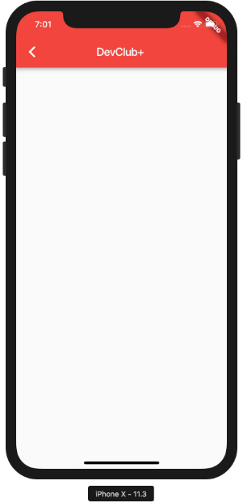
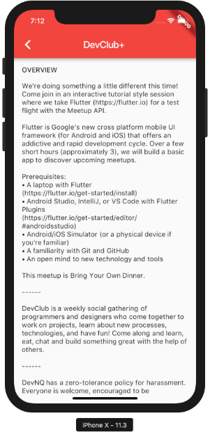
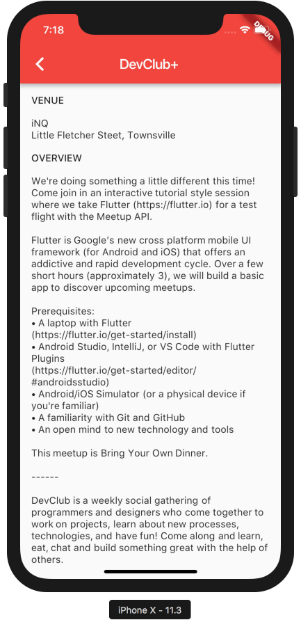
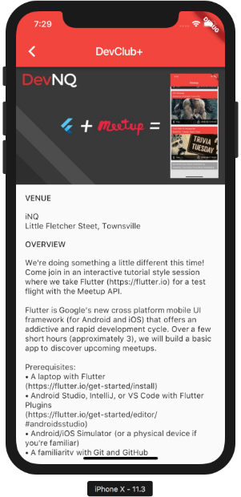

# Phase 3
## Showing some event detail

Now that we have some details displayed about each event, it's time to drill down further for detail. Let's start by
defining an `EventDetailWidget`.

1. Create a new `event_details.dart` file.
2. Create a new `StatelessWidget` to show more details about our event

 ```dart
// event_details.dart
//
// Add in some packages to make our lives easier
//
import 'package:feather/feather.dart';
import 'package:flutter/material.dart';
import 'package:flutter/widgets.dart';

//
// Create the new StatelessWidget (because we won't be modifying the event)
//
class EventDetails extends StatelessWidget {
  final Map event;

  EventDetails(this.event);

  @override
  Widget build(BuildContext context) {
    var name = get(event, 'name');

    //
    // Keeping with the layout of the app already, lets use Scaffold again
    //
    return new Scaffold(
      appBar: AppBar(
        title: new Text(name),
      ),
      body: new Column(
        children: <Widget>[],
      ),
    );
  }
}
 ```

3. Add an action to navigate to this view from our main list

```dart
// actions.dart
//
// Import the material package to gain access to the `Navigator`
//
...
import 'package:flutter/material.dart';
...

//
// Add a `navTo` function to push the new view into the stack for us
//
void navTo(context, view) {
  Navigator.push(
      context,
      MaterialPageRoute(
        builder: (context) => view,
      ));
}
...

```

4. Wire up the navigation action to a touch event on an event list item
  * Import our `event_details.dart` so we can access our new widget
```dart
// main.dart
...
//
// Import our new Event details widget
//
import 'package:flockup/event_details.dart';
...
```

  * Within the `buildEventListItem`, we'll create a new function to add an `onTap` handler for public events. We can do
  this by wrapping our current Widget tree in an Inkwell (A rectangular area of a Material that responds to touch).

```dart
Widget buildEventListItem(BuildContext context, Map event) {

...
  //
  // Create a new function to wrap the current layout in an `Inkwell`
  //
  Widget inkwellIfPublic(Widget child) {
    if (!isPublic) {
      //
      // The event isn't public, so we have no more details to show. Let's not make that event tappable
      //
      return child;
    }
    return new InkWell(
      onTap: () => navTo(context, new EventDetails(event)),
      child: child,
    );
  }

...

  return new Padding(
    padding: const EdgeInsets.only(bottom: 8.0),
    child: inkwellIfPublic(                     // <-- New
      Column(children: <Widget>[
        header,
        imageOrPlaceholder(),
        footer,
      ]),
    ),
  );
}

```

If all has gone well so far, we should be able to navigate into some events and back



## Event Detail Layout
Phew, That's the hard part out of the way, so let's finish the event layout. I invision three sections: Photo, venue
details, and overview details.

1. Create a new function in `event_details.dart` that will build our `overviewSection`.

```dart

List<Widget> overviewSection(context, event) {
  var details = get(event, 'plain_text_description');
  var theme = Theme.of(context).textTheme;
  //
  // Sometimes events don't have a description yet. In this case, there is no point showing the section, so we return
  // null
  //
  if (isNotNull(details)) {
    return [
      Text(
        'OVERVIEW',
        style: theme.body2,
      ),
      Padding(
        padding: const EdgeInsets.symmetric(
          vertical: 8.0,
        ),
      ),
      Text(details),
    ];
  }
}

```

2. Update our `EventDetails` widget to use the overviewSection function

```dart
class EventDetails extends StatelessWidget {
  ...
  @override
  Widget build(BuildContext context) {
    ...
    //
    // Create a new list for all our detail widgets, then add everything created by the `overviewSection` to it
    //
    final List<Widget> details = []..addAll(overviewSection(context, event));
    ...
    return new Scaffold(
      appBar: AppBar(
        title: new Text(name),
      ),
      body: new Column(children: [
        //
        // Change our body to use an Expanded, Padded ListView. This will give our widgets a structured layout with
        // scrolling capabilities for information tha flows offscreen (like the events list).
        //
        new Expanded(
          child: Padding(
            padding: const EdgeInsets.all(16.0),
            child: ListView(
              children: nonNullWidgets(details),
            ),
          ),
        ),
      ]),
    );
  }
}
```



3. Create a `venueOverview` function to layout out venue details, then add that tou the `EventDetails` Widget.

```dart
//event_details.dart

...

List<Widget> venueSection(context, event) {
  var venue = get(event, 'venue');
  var theme = Theme.of(context).textTheme;
  if (isNotNull(venue)) {
    var address = ['address_1', 'city']
        .map((f) => get(venue, f))
        .where(isNotNull)
        .join(", ");
    var spacer = new Padding(
      padding: const EdgeInsets.symmetric(
        vertical: 8.0,
      ),
    );
    return [
      new Text(
        'VENUE',
        style: theme.body2,
      ),
      spacer,
      new Text(get(venue, 'name')),
      new Text(address),
      spacer,
    ];
  }
}

...

class EventDetails extends StatelessWidget {
  ...
  @override
  Widget build(BuildContext context) {
    ...
    //
    // Add our `venueSection` Widgets first
    //
    final List<Widget> details = []
      ..addAll(venueSection(context, event))
      ..addAll(overviewSection(context, event));
    ...
  }
}

```

Our app should now have some basic information about the event



4. Finally, let's add in the event image again to bring some colour to the page. For reuseability, move the
   `imageOrPlaceholder` function into a `ui.dart` and tweak it to take an event map.

```dart
//event_details.dart
import 'package:flutter/ui.dart';

...

class EventDetails extends StatelessWidget {

  ...

  @override
  Widget build(BuildContext context) {
    return new Scaffold(
      appBar: AppBar(
        title: new Text(name),
      ),
      body: new Column(children: [
        imageOrPlaceholder(event),             //<-- new
        new Expanded(
          child: Padding(
            padding: const EdgeInsets.all(16.0),
            child: ListView(
              children: nonNullWidgets(details),
            ),
          ),
        ),
      ]),
    );
  }
}
```

That's it! Our basic *Flockup* app is functional. The only thing left is to play around with the layouts to see what
else you can create and add in.


